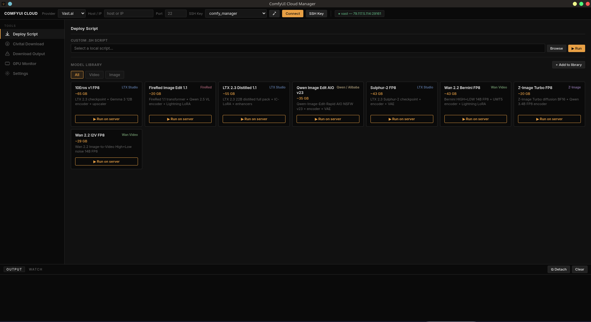

# ComfyUI Cloud Manager

A desktop application for deploying and managing ComfyUI on cloud GPU providers (RunPod, Vast.ai) without touching a terminal. One-click model download, live output sync, GPU monitoring — all from a native window on your local machine.

---

## Table of Contents

- [Overview](#overview)
- [Features](#features)
- [Model Library](#model-library)
- [Requirements](#requirements)
- [Installation](#installation)
- [First Run](#first-run)
- [Usage](#usage)
  - [Connecting to a server](#connecting-to-a-server)
  - [Deploying a script](#deploying-a-script)
  - [Civitai download](#civitai-download)
  - [Custom Nodes](#custom-nodes)
  - [Download Output](#download-output)
  - [GPU Monitor](#gpu-monitor)
  - [Settings](#settings)
- [Security](#security)
- [Building binaries](#building-binaries)
- [Project structure](#project-structure)
- [Changelog](#changelog)
- [Contributing](#contributing)

---

## Overview



ComfyUI Cloud Manager bridges your local machine and a remote GPU server over SSH. You configure the connection once, then use the app to:

- Deploy model-download scripts from a curated library or upload your own
- Pull generated images/videos back to your Desktop automatically
- Monitor GPU usage in real time
- Download models from Civitai directly onto the remote server

No SSH terminal knowledge required for day-to-day use.

---

## Features

| Feature | Description |
|---|---|
| **Script Library** | 9 pre-built download scripts for popular video and image models, filterable by category |
| **Custom script deploy** | Upload and run any `.sh` script on the remote server |
| **Civitai Download** | Download any Civitai model directly to the server — no local storage used |
| **Custom Nodes** | Install nodes via git clone (public or private with GH token), update with git pull, or upload a local folder directly |
| **Fetch once** | One-shot rsync: pull all output files from the server to your local folder |
| **Watch live** | Background polling: new files are downloaded automatically at a configurable interval |
| **GPU Monitor** | Live VRAM usage, temperature, and utilization streamed via SSH |
| **SSH Key Manager** | Generate a dedicated ed25519 key-pair from inside the app, or select an existing one |
| **System tray** | App minimizes to tray; watch status is visible at a glance |
| **Cross-platform** | Linux, macOS, Windows |

---

## Model Library

Eight scripts are included, covering the latest open-source video and image generation models.

### Video models

| Name | Size | Description |
|---|---|---|
| **10Eros v1 FP8** | ~65 GB | LTX 2.3 checkpoint + Gemma 3 12B encoder + spatial upscaler |
| **10Eros v1 BF16** | ~64 GB | Full-precision BF16 variant — recommended for A40 (48 GB VRAM) |
| **Sulphur-2 FP8** | ~43 GB | LTX 2.3 Sulphur-2 checkpoint + encoder + VAE |
| **LTX 2.3 Distilled 1.1** | ~55 GB | LTX 2.3 22B distilled full pack + IC-LoRA + enhancers |
| **Wan 2.2 Bernini FP8** | ~43 GB | Bernini HIGH+LOW 14B FP8 + UMT5 encoder + Lightning LoRA |
| **Wan 2.2 I2V FP8** | ~29 GB | Image-to-Video High+Low noise 14B FP8 |

### Image models

| Name | Size | Description |
|---|---|---|
| **FireRed Image Edit 1.1** | ~20 GB | FireRed 1.1 transformer + Qwen 2.5 VL encoder + Lightning LoRA |
| **Qwen Image Edit AIO v23** | ~35 GB | Qwen-Image-Edit-Rapid AIO NSFW v23 + encoder + VAE |
| **Z-Image Turbo FP8** | ~20 GB | Z-Image Turbo diffusion BF16 + Qwen 3.4B FP8 encoder |

All scripts download models directly from HuggingFace onto the remote server. No model files pass through your local machine.

---

## Requirements

### Local machine (your computer)

- **Node.js v18 or newer** — [nodejs.org/en/download](https://nodejs.org/en/download)
- **SSH client** — pre-installed on Linux, macOS, and Windows 10+
- **rsync** — pre-installed on Linux and macOS; on Windows install via [WSL](https://learn.microsoft.com/en-us/windows/wsl/) or [Git for Windows](https://gitforwindows.org/)

### Remote server (RunPod / Vast.ai)

- ComfyUI already installed (use the official ComfyUI templates on both providers)
- SSH access enabled and port exposed
- `wget` or `curl` available (standard on all GPU images)

---

## Installation

### Option A — one-click script (recommended for most users)

Clone the repository, then run the appropriate script:

```bash
git clone https://github.com/daveinme/ComfyUI-Cloud-Manager.git
cd ComfyUI-Cloud-Manager
```

**Linux / macOS:**
```bash
./install.sh
```

**Windows:** double-click `install.bat`

On first run the script checks for Node.js, installs dependencies, creates a desktop shortcut, and launches the app.

### Subsequent launches

After the first install, use the lighter start scripts — they skip the setup check and launch immediately:

**Linux / macOS:**
```bash
./start.sh
```

**Windows:** double-click `start.bat`

On Linux a `ComfyUI Cloud Manager.desktop` shortcut is also created in the app folder on first run — drag it to your Desktop or application launcher.

### Option B — manual

```bash
git clone https://github.com/daveinme/ComfyUI-Cloud-Manager.git
cd ComfyUI-Cloud-Manager
npm install
npm start
```

---

## First Run

1. **Generate an SSH key** — open the **SSH Key** panel from the connection bar button. Click *Generate key*. The app creates `~/.ssh/comfy_manager` (ed25519). Copy the displayed public key.
2. **Add the public key to your server** — paste it into the *Authorized SSH Keys* field of your RunPod or Vast.ai instance before starting it.
3. **Connect** — enter the server host and port in the top bar, select your key, choose the provider, and click *Connect*. A quick connection test runs and shows GPU info in the log.
4. **Configure tokens** — open *Settings* and enter your HuggingFace token (`hf_...`). If you plan to download from Civitai, add your Civitai token too.

---

## Usage

### Connecting to a server

The top bar is always visible:

```
Provider ▾  |  host or IP  |  port  |  SSH key ▾  |  [Connect]  [Open ComfyUI]  [SSH Key]
```

- **Provider** — select RunPod or Vast.ai. This sets the default paths for models and output.
- **Host / Port** — copy them from your instance dashboard.
- **SSH key** — the dropdown lists all private keys found in `~/.ssh/`. Select the one whose public key is on the server.
- **Connect** — tests the connection and prints GPU info.
- **Open ComfyUI** — opens the ComfyUI web interface in your browser (port 8188).

The connection settings are saved automatically and restored on next launch.

---

### Deploying a script

**From the library:**

1. Go to *Deploy Script* in the sidebar.
2. Use the filter buttons (*All / Video / Image*) to browse the library.
3. Click **▶ Run** on any card.

The script is uploaded to `/tmp/` on the server via SCP, then executed. Your HuggingFace token is injected as an environment variable for the duration of that SSH session — it is never stored on the server.

**Custom script:**

Click *Browse* next to the *Custom .sh script* field, select any local `.sh` file, and click **▶ Run**.

**Log output** streams in real time in the log panel at the bottom.

---

### Civitai download

1. Go to *Civitai Download* in the sidebar.
2. Paste a Civitai model URL (supports both `civitai.com` and `civitai.red`).
3. Choose the destination folder (`loras`, `checkpoints`, `diffusion_models`, etc.).
4. Enter the file name (without `.safetensors`).
5. Click **⬇ Download to Server**.

The file is downloaded directly onto the remote server. Your Civitai token is passed securely from Settings.

---

### Custom Nodes

The **Custom Nodes** panel lets you install and manage ComfyUI custom nodes on the remote server without opening a terminal.

**Install from GitHub (git clone)**

1. Go to *Custom Nodes* in the sidebar.
2. Paste the GitHub repository URL (e.g. `https://github.com/author/repo`).
3. For private repositories, enter your GitHub personal access token in the *GH Token* field — it is used only for this clone and never stored on the server.
4. Click **⬇ Clone**. The node is cloned into `custom_nodes/` and dependencies are installed automatically if a `requirements.txt` is present.

**Update an installed node (git pull)**

1. Enter the node folder name (as it appears in `custom_nodes/`).
2. Click **↑ Pull**. The app runs `git pull` on the remote folder.

**Upload a local folder**

Use this for private nodes that are not on GitHub at all (e.g. nodes under active development on your machine).

1. Click **Browse** and select the node folder on your local machine.
2. Click **⬆ Upload**. The app uses rsync to transfer the folder to `custom_nodes/`, automatically excluding `__pycache__`, `.pyc`, and `.git` files.
3. If a `requirements.txt` is found, dependencies are installed on the server automatically.

> **Note:** after installing or updating a node, restart ComfyUI on the server for it to be loaded.

---

### Download Output

The **Download Output** panel has two modes:

**📦 Fetch once**
Runs a single rsync to pull all files from the server's output folder to a local path. Choose a preset folder or browse for a custom one, set the subfolder name, and click *Download Files*.

**👁 Watch live**
Polls the server at a configurable interval (default: 15 seconds) and downloads any new files automatically. Useful while a long generation is running — you see results arrive on your Desktop in real time. Watch runs in the background; the app minimizes to tray and shows the status there.

Local destination presets are configured in Settings under *Local Output Paths*.

---

### GPU Monitor

Click **▶ Start Monitor** to begin streaming GPU stats via SSH:

- VRAM used / total
- GPU temperature
- GPU utilization %
- Power draw

Click **■ Stop** to end the stream.

---

### Settings

| Field | Description |
|---|---|
| **HuggingFace Token** | `hf_...` token from [huggingface.co/settings/tokens](https://huggingface.co/settings/tokens). Required for all model downloads. |
| **Civitai Token** | From your Civitai account settings. Required for Civitai downloads. |
| **Local Output Paths** | One preset per line, format `Label\|/absolute/path`. These appear as quick-select buttons in the Download Output panel. |
| **Remote Output Path** | Override the auto-detected output path on the server (leave empty for default). |
| **Remote Models Path** | Override the auto-detected models path on the server (leave empty for default). |

Click *Save* after any change.

---

## Security

- **Tokens are never hardcoded** — all API keys live in `~/.config/comfy-cloud-manager/config.json` on your local machine (permissions `0600`).
- **Tokens are never stored on the server** — they are injected as shell environment variables for the lifetime of a single SSH session, then discarded.
- **Scripts fail safely** — each download script checks that `HF_TOKEN` is set before doing anything; if it is missing the script exits immediately with a clear error message.
- **SSH** — the app uses `StrictHostKeyChecking=no` for convenience on ephemeral cloud instances. If you reuse the same server long-term, consider removing that flag in `index.js`.

---

## Building binaries

To produce standalone installable files that require no Node.js:

```bash
# Current platform only
npm run build:linux   # → dist/*.AppImage
npm run build:win     # → dist/*.exe  (NSIS installer)
npm run build:mac     # → dist/*.dmg

# All platforms at once (requires platform-specific toolchains)
npm run build:all
```

Output is written to `dist/`. Upload the binaries to GitHub Releases so users can download and run with a double-click.

> **Note:** building for Windows on Linux requires Wine; building for macOS on Linux requires additional setup. The easiest approach is to run each build command on its native OS, or use GitHub Actions with a matrix build.

---

## Project structure

```
comfy_gui/
├── index.js          # Main process — SSH, IPC handlers, file I/O
├── index.html        # Renderer — all UI, CSS, and frontend JS
├── preload.js        # Context bridge (exposes window.api to renderer)
├── log_window.html   # Detached log window
├── package.json
├── install.sh        # One-click launch — Linux / macOS
├── install.bat       # One-click launch — Windows
└── scripts/
    └── download/     # Model download scripts (.sh)
        ├── 10Eros_v1-bf16.sh
        ├── 10Eros_v1-fp8mixed.sh
        ├── FireRed-Image-Edit.1.1.sh
        ├── LTX23-Distilled-1.1.sh
        ├── Qwen-Image-Edit-Rapid-AIO-V23.sh
        ├── Sulphur2-dev-FP8-mixed.sh
        ├── Wan22_Bernini_fp8.sh
        ├── wan2.2_i2v_high_noise_14B_fp8_scaled.sh
        └── Z-Image-Turbo-FP8.sh
```

---

## Changelog

### v0.3.0 — 2026-06-13

**New features**
- **Custom Nodes panel** — install nodes via `git clone` (public or private with GH token), update with `git pull`, or upload a local folder via rsync. Dependencies from `requirements.txt` are installed automatically. `__pycache__` and `.pyc` files are excluded from uploads.

**Download scripts**
- `10Eros_v1-bf16.sh` — new script for the full BF16 variant of 10Eros v1 (recommended for A40 / 48 GB VRAM)
- `LTX23-Distilled-1.1.sh` — updated Kijai dynamic LoRA from `rank_105` to `rank_111` (distilled-1.1); added `sulphur_experimental_lora_v1`
- `Sulphur2-dev-FP8-mixed.sh` — added `sulphur_experimental_lora_v1`

---

### v0.2.0 — Initial release

- Script library with 8 download scripts
- Civitai direct download
- Fetch once / Watch live output sync
- GPU Monitor
- SSH Key Manager
- System tray

---

## Contributing

Pull requests are welcome. To add a new model to the library:

1. Write a download script in `scripts/download/YourModel.sh` following the existing pattern:
   - Auto-detect the ComfyUI path
   - Guard on `HF_TOKEN` / `CIVITAI_TOKEN` — no hardcoded keys
   - All output strings in English
   - Verify installation at the end
2. Add an entry to `LIBRARY_META` in `index.js`:
   ```js
   'YourModel.sh': { name: 'Display Name', gb: '~X GB', category: 'video|image', author: 'Studio', desc: 'Short description' }
   ```
3. Open a PR with a brief description of the model.

---

## License

MIT
